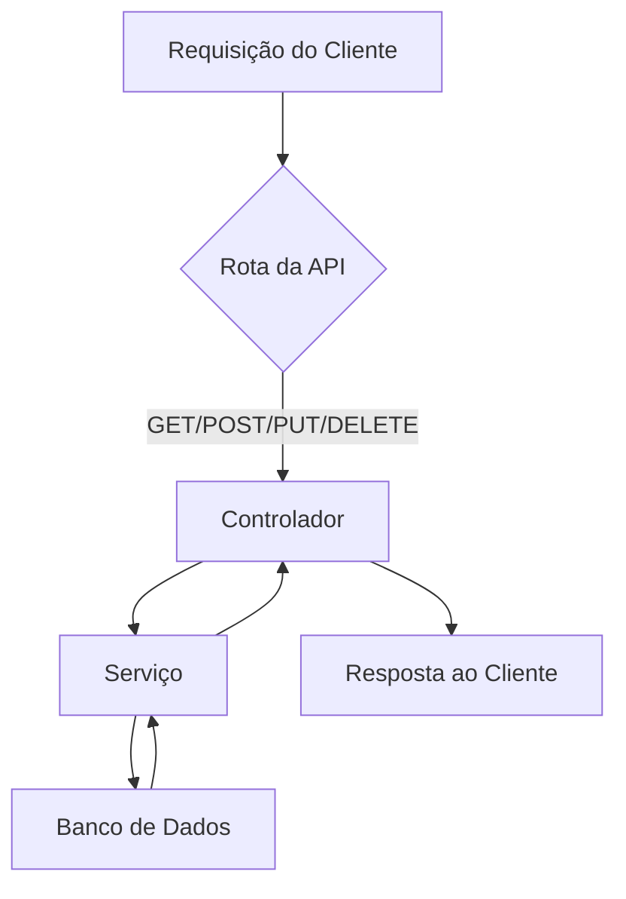

# API Simples

## Descrição

Esta é uma API simples desenvolvida para fins de estudo e demonstração de conceitos básicos de desenvolvimento backend.

## Instalação

```bash
git clone <url-do-repositório>
cd <nome-da-pasta>
npm install
```

## Uso

```bash
npm start
```

Acesse `http://localhost:3000` para utilizar a API.

## Funcionalidades

- CRUD de recursos
- Validação de dados
- Rotas RESTful
- Respostas em JSON

## Diagrama de Fluxo

